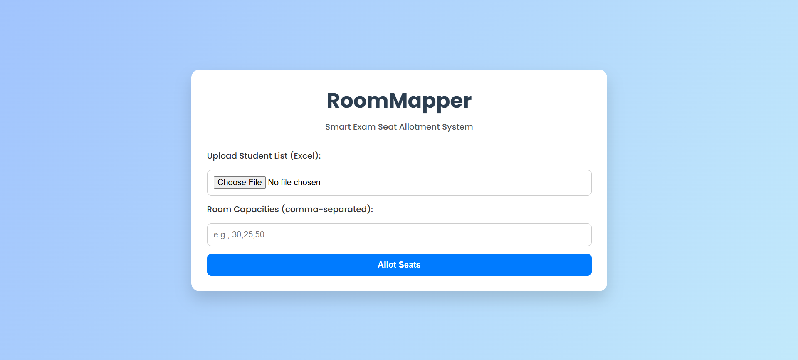
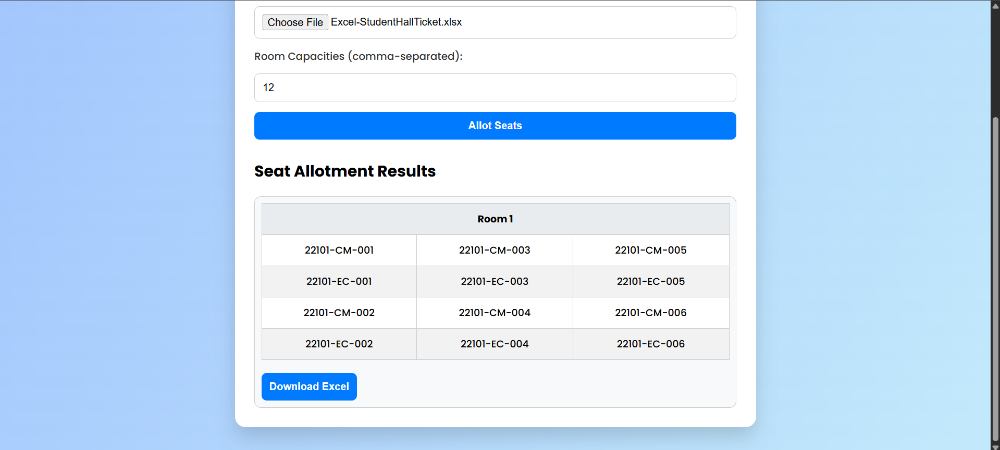

# RoomMapper 🪑📋

**RoomMapper** is a smart, responsive web application that simplifies the process of **exam hall seat allotment**. Just upload your student and room data in Excel format — RoomMapper will handle the logic and generate a downloadable result!

> ⚡ Built entirely using HTML, CSS, and JavaScript — no server or database setup required!

---

## 🌟 Features

- 📁 Upload Excel file with **Student Pin Numbers**
- 🪑 Automatically allocates students to rooms based on given capacity
- 📥 Generates clean, downloadable **Excel output**
- 💻 Fully **client-side** — your data stays private!
- 🎨 Sleek and **responsive UI** that works on all devices

---

## 🖥️ Tech Stack

- ✅ **HTML5**  
- ✅ **CSS3** — for modern, responsive design  
- ✅ **JavaScript** — logic, DOM control, and file handling  
- ✅ **SheetJS (xlsx.js)** — for reading and writing Excel files  

---

## 📸 Screenshots

| Home Page | Output Table |
|-----------|--------------|
|  |  |

---

## 🚀 Live Preview
- To see Live Preview Download The PinNumbers File [**Click Here To Download**](https://tinyurl.com/ExcelFile-RoomMapper)

🔗 [**Try RoomMapper Live**](https://devarajb049.github.io/RoomMapper---Smart-Exam-Hall-Seat-Allotment-System/)

---

## 📂 How to Use

### 🔧 Steps

1. **Clone the Repository**:

   ```bash
   git clone https://github.com/Devarajb049/RoomMapper---Smart-Exam-Hall-Seat-Allotment-System.git
   cd RoomMapper---Smart-Exam-Hall-Seat-Allotment-System
